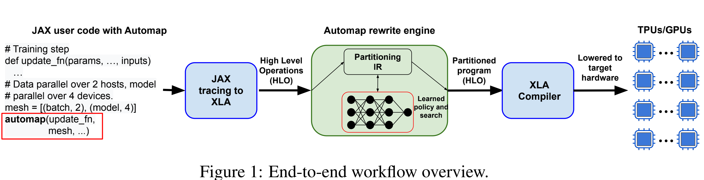
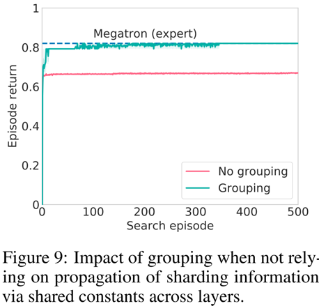

# AutoMap

This method is proposed by **DeepMind**.

This rewrite engine is implemented in MLIR with an XLA backend, and a python API in JAX. Rewrite sequences are evaluated
through compiler-internal cost models (estimating peak memory, runtime and communication).

AutoMap search strategies based on **Search and Learn** algorithm.

The Search is based on Monte Carlo Tree Search (MCTS) with upper confidence bound for trees (UCT).

The Learning uses a DeepMind model called [**Interaction Network**](https://arxiv.org/pdf/1612.00222.pdf). This model
was trained on a dataset of 20k transformer variants, and used to predict the importance of a node to be partitioned.
The top-k most relevant nodes are then passed to MCTS for searching strategies.

This method costs few minutes to find a Megatron-LM performance-like strategy with **search and learn**.

### More work is needed to support that, a learned system in interactive compiler workflows can

handle a variety of generally unpredictable user models.

## Scalability

For large models, relies on propagation sharding information through subtly shared constants and other computations
**across layers**. Sharing information is brittle. Model with replicated blocks (like transformers, resnet), search
techniques scale unfavourably when having to explicitly rewrite for each layer. So Automap allows users to group
repeated layers together and exposes only a single set of decisions per group. This hint setting helps to search
megatron-lm like strategies within a short time.

## Discussion

### from paper

- The results presented in paper is restricted to sharding within the devices of a single host, while assuming data
  parallelism across hosts, which simplifies the communication cost model.
- More advanced cost models are required to model multi-host communication, as well as device-specific lowering (like
  fusion)
- Pipeline and ZeRO offloading. 