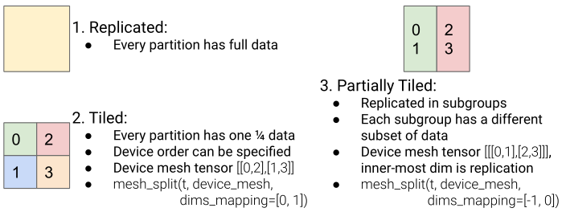

# Code

The implementation code is in tensorflow/compiler/xla.
An example can be found [here](https://github.com/tensorflow/tensorflow/blob/master/tensorflow/compiler/xla/experimental/xla_sharding/xla_sharding.py)

# Methods Summary

## GSPMD

GSPMD is a system that uses simple tensor sharding annotations to achieve different parallelism paradigms in a unified
way.

GSPMD is implemented as an extension to a production ML compiler, XLA. GSPMD natively supports **in-opeartor**
parallelism, which includes data-parallelism, model-parallelism, pipeline parallelism, spatial partitioning as well as
ZeRO. Though pipeline is not an in-operator parallelism, it **could be reduced to an operator partitioning**
problem.

GSPMD has two independent compiler transformation: sharding completion and per-operator partitioning.

### Sharding completion

GSPMD defines three types of sharding:

- Replicated: All devices have the same full data.
- Tiled: Each device occupies the corresponding tile in the data tensor, without data duplication.
- Partially tiled. Replicated in subgroups. Each subgroup has a different subset of data.

mesh_split(tensor, device_mesh, dims_mapping) is the primary API that GSPMD provides for users.

#### Pipeline parallelism reduced to tensor sharding

GSPMD reduce pipelining into a layer-wise sharding problem. Imagine that the layer computation is rewritten in a
stage-parallel way, where a leading layer/stage dimension L has been added to each tensor, and the computation is
entirely parallel on this dimension. This transformation can be done by existing frontends' vectorization support like
JAX's vmap()
and TensorFlow's vectorized_map().

User annotate the L dimension to be sharded, then GSPMD will turn the buffer shifting into cross-device communication
via CollectivePermute to do the pipeline.

This pipelining implementation runs naturally when combined with other types of parallelism in GSPMD.

However, it could only be used in **homogeneous pipeline stages**(Like BertEncoder in transfromers). For heterogeneous
pipelining, it is recommended to use GPipe, Tera-Pipe, PipeDream, etc.

#### Intuitive sharding completion

GSPMD can auto-complete the sharding on every tensor based on limited user annotations. This is implemented as a
compiler pass in XLA. The design goal is to make the sharding decisions intuitive to users even if they only annotate a
small subset of tensors.

### Per operator partitioning

This step automatically partition operator with the result from Sharding completion.

### Comparison

FlexFlow focuses on determining the partitioning policy, while GSPMD focuses on the mechanisms to transform an annotated
graph. They are complementary to each other. Automated search combined with GSPMD could provide a fully automated
system.

DistIR is an MPMD-style intermediate representation for distributed ML computattions. It focuses on the representation
itself but does not provide a transformation to automatically parallelize programs like GSPMD.
