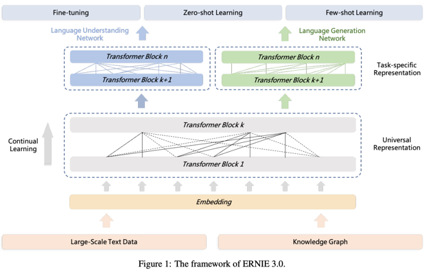

|Time |  Name  | Organization | Model size | Dataset size | Devices| Backbone| paper | Parallel Methods | Optimizer |
| ---|--- | --- | --- | ---  | --- | --- | --- | --- |---|
|2022.4.5 | PaLM | Google | 540 B | 780 B tokens | 2x TPU v4 pod(2*3072)| Singleton | [arxiv](https://arxiv.org/pdf/2204.02311.pdf) | Pathways, inter-pod: DP=2。intra-pod: DP=256,TP=12 | Adafactor 
|2022.2.4 | Megatron-Turing NLG | Microsoft & Nvidia | 530 B |339 B tokens | 560 80GB A100| Singleton| [arxiv](https://arxiv.org/pdf/2201.11990.pdf) |ZeRO-D=2, T=8, P=35| Adam 1.6e-4, beta1=0.9, beta2=0.95
|2021.12.9 | GLaM  | Google Brain | 1.162T | 1.6 T tokens | [1024 TPUv3?](\textsc{https://ai.googleblog.com/2021/12/general-and-scalable-parallelization.html}) |GShard MoE Transformer | [blog](https://ai.googleblog.com/2021/12/more-efficient-in-context-learnning-with.html) | GShard, 64 experts per MoE layer with 32 MoE layers in total | Unknown
|2021.12.8 |Gopher | Google DeepMind | 280 B | 5GB?? | 4096 16 GB TPUv3 | Singleton | [deepmind](https://storage.googleapis.com/deepmind-media/research/language-research/Training%20Gopher.pdf) | T,D,P ZeRO-stage1. details ungiven. Maybe given by [Automap](https://arxiv.org/pdf/2112.02958.pdf)| Adam in pre-traininig, adafactor in fine-tuning
|2021.12.8| Wenxin | Baidu and PengCheng Lab | 260 B | 68 datasets | 1920 Ascend 910 NPU |ERNIE 3.0 Titan| [arxiv](https://arxiv.org/pdf/2112.02752.pdf) | Resource-aware acceleration. D=4, 4D parallelism (DP+MP+PP+ZeRO) | Adam 1e-4 beta1=0.9 beta2=0.95
|2021.10.25| M6-10T | Alibaba | 10T | 16 GB | 512 32GB V100 | M6 | [arxiv](https://arxiv.org/pdf/2110.03888.pdf) | ZeRO-Stage3,Offload, T, P, E | possibly Adafactor (Not given)
|2021.9.28 | Yuan 1.0 | Inspur | 245.7 B | 5 TB | 2128 GPUs (type unknown)| Singleton | [arxiv](https://arxiv.org/pdf/2110.04725.pdf) | T=8, P=38, D=7 | Adam 1.6e-4, beta1=0.9, beta2=0.95
|2021.8 | Jurassic-1 | AI21 | 178B | 300B tokens  | Thousands of GPU | Singleton | [tech paper](https://uploads-ssl.webflow.com/60fd4503684b466578c0d307/61138924626a6981ee09caf6_jurassic_tech_paper.pdf) | Megatron and ZeRO | batch=3.2M tokens, lr: 0.6e-4 
|2021.5 |Wudao 2.0 | BAAI | 1.75 T | 4.9 TB | ? | Cogview, CPM | ? | Zero-Stage-2, expert ? | ?
|2021.4.26 | Pangu-alpha | Huawei and PengCheng Lab | 207 B | 1.1 TB | 2048 Ascend 910 NPU| Singleton | [arxiv](https://arxiv.org/pdf/2104.12369.pdf) | T=8, P=16, ZeRO-Stage1-D=16 | Adam 2e-4, beta1=0.9, beta2=0.95
|2020.5 | GPT3 | Open-AI | 175 B | 570 GB | 10000 V100 GPUs? | Singleton |[arxiv](https://arxiv.org/pdf/2005.14165.pdf) | Model and Data parallelism, details unknown| 0.6e10-4, beta1=0.9, beta2=0.95

## PaLM
First model that uses Pathways to train.

| layers | hidden_size | num_heads | FFN_size  | seq_length 
| ------ | ----------- | --------- | --------- |  -----|
|   118   |    18432    |    48    |  73728   | 2048|

## Megatron-Turing NLG

Transformer decoder.

Use PipeDream pipeline. 

| layers | hidden_size | num_heads | FFN_size  | seq_length 
| ------ | ----------- | --------- | --------- |  -----|
|   105   |    20480    |    128    |  ?   | 2048|

## GLaM

It only activates a subnetwork of 97B (8%) parameter per token during inference.

The power consumption is about 1/3 of GPT-3's.

Use Zero-shot and one-shot setting where the tasks are never seen during training.

In evaluation, outperform GPT-3 and use less training time to converge.

## Gopher

Perspective: **It is still effective to enlarge model size.**

## Wenxin (Ernie 3.0 Titan)

Universal Representation Module and Task-specific representation module.

Universal Representation Module setup: Scales up the FFN_size to increase model capacity.

| layers | hidden_size | num_heads | FFN_size  | 
| ------ | ----------- | --------- | --------- |  
|   48   |    12288    |    192    |  196608   |

Task-specific representation module setup:

| layers | hidden_size | num_heads |  FFN_size  | 
| ------ | ----------- | --------- | ---------- |  
|   12   |     768     |     12    |  unknown   |

## Yuan 1.0

76 layers, hidden size is 16384. Global batch size is 3360 and micro batch size is 1. Sequence length is 2048.

The dataset consists of filtered data: crawled web pages (4200 GB), public dataset (268 GB), Encyclopedia(10.5 GB) and
Books(655 GB).

Trained using zero-shot and few-shot.

## M6-10T

| layers | hidden_size | num_heads | FFN_size | expert_num | training_batch_size
| ------ | ----------- | --------- | -------- |  ---| --- |
|  48    |  1024      |   16    |  9984   | 10240 experts, 80 prototypes | 8 per GPU

Use Pseudo-to-Real training skill, and offloading to train M6-10T on 512 V100 in ten days.

This model has no downstream test now.

## Jurassic-1 Jumbo

has a large vocabulary up to 256K while GPT-3 has 50K.

| layers | hidden_size | num_heads | FFN_size | 
| ------ | ----------- | --------- | -------- |  
|   76   |    13824    |    96    |  65536   |

## Pangu-alpha

| layers | hidden_size | num_heads | FFN_size | 
| ------ | ----------- | --------- | -------- |  
|   64   |    16384    |    128    |  65536   |     

## GPT-3 175B

| layers | hidden_size | num_heads | batch_size | 
| ------ | ----------- | --------- | ---------- |  
|   96   |     12288   |     96    |   3.2 M tokens  |
