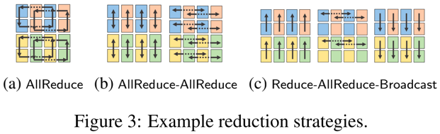

Synthesizing Optimal Parallelism Placement and Reduction Strategies on Hierarchical Systems For Deep Learning

From University of Cambridge and DeepMind

# Summary

- A new method that reduce the space of software-to-hardware mapping.

- Offer a synthesis framework %P^2% that can decompose reductions over one or more parallelism axes to sequences of
  collectives in a hierarchy- and mapping-aware way.

- For 69 % of parallelism placements, proposed framework synthesized programs **outperform** default all-reduce
  implementation.

- Use a simulator that exceeds 90% top-10 accuracy to help complement synthesis tool, which therefore reduces the need
  for massive evaluations of synthesis results to determine a small set of optimal programs and mappings.

## Some  concepts explanations

- **Parallelism axis**: each form of parallelism
- **Parallelism placement**: How we map parallelism over devices. This decides the communication groups as well as
  communication cost.
- **reduction axis**: Reduction along the axis of model parallelism or data parallelism.

## Contributions

- Parallelism placement synthesis: Given parallelism axes, reduction axes and a hierarchical system topology, P^2 can
  automatically synthesizes hierarchical parallelism placements, where parallelism placement is modelled as a
  parallelism matrix mapping from parallelism axes to the system hierarchy.
- Reduction strategy synthesis: For each parallelism placement, P^2 utilizes the system hierarchy to further synthesize
  a wide variety of reduction strategies to implement reductions using common collective operations.
- Synthesis hierarchy： parallelism matrix determines a candidate parallelism placement, and it can be used by the
  synthesizer to massively reduce the space of programs.
- Simulator: Use a simulator to help evaluate reduction strategies produced by P^2.

## Key design

1. Parallelism Placement

   Critical idea: To reduce search space, the critical idea of P^2 is to **partition parallelism axes over the system
   hierarchy to generate topology-aware parallelism placements**, while still being able to systematically generate a
   wide range of parallelism placements.

   Results: result of parallelism placement synthesis is a parallelism matrix, where each element is a parallelism
   factor representing the number of a specific level in the hierarchy that a parallelism form splits the computation
   across.

   Parallelism matrices decide communication requirements.

2. Reduction Strategy

   For each parallelism matrix, P^2 further synthesizes topology-aware reduction strategies using common collective
   operations, which allows us to find the optimal reduction strategy for any given parallelism matrix.

   Below figure shows different reduction strategy on a produced placement.

   

3. Formalism of Collective Operations

   **Semantically Invalid reduction steps**：Reduction steps which result in device states that can never reach the final
   wanted state.

   P^2 provides a formalism of common collective operations that captures semantic correctness and rules out
   semantically invalid programs, massively reducing the synthesis space.

   Each device state is defined as a **state matrix** describing what kind of data a device has.

4. Reduction Communication Patterns

   To synthesize reduction strategies effectively, P^2 uses a domain-specific language(DSL) that explores the hierarchy
   to generate hierarchical communication patterns.

5. Synthesis Hierarchy

   Exploration with multiple reduction axes.

## Program Synthesis Algorithm

## Results

- The performance of AllReduce differs significantly among parallelism matrices, up to 448.5x. (Intra-node communication
  is faster than inter-node communication)

- Pruning techniques are effective for the synthesizer to achieve fast synthesis time.

- If the reduction axes can be put within one node, then a **single step AllReduce** inside that node is the most
  effective reduction due to fast local bandwidth.

- Synthesized programs can help alleviate the impact of parallelism placement.

- For inter-node reduction, a **topology-aware reduction program** tends to outperform a single step AllReduce, with speedup
  on average 1.28x , upto 2.04x.
