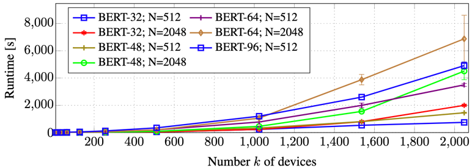
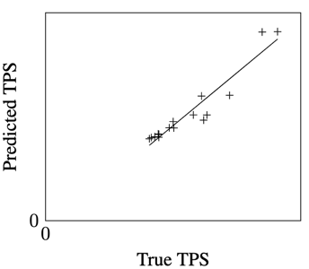

# Piper

## inputs

Piper is given as input a DNN workload (model), which is represented as a DAG. Each Node corresponds to a single DNN
layer. Each Edge (u, v) corresponds to a data transfer:
node v requires the output of u as its input. The input graph is annotated with a number of attribtues related to
compute times, communication costs and memory usage. These attribtues should be profiled or estimated.

Furthermore, Piper is given: the number of devices (K),available memory per device (M), the network bandwidth (B), and
the maximum allowed number of microbatches in a batch (N).

In short：

- a Directed Acyclic Graph G=(V,E): layer graph of a DNN,
- for every edge (u,v), an associated communication cost c(u,v) (in bytes).
- number K of devices, memory M per device, network bandwidth B, [maximum] number N of microbatches in a batch,
- for every node/layer v, and every degree t=1,...,K of tensor parallelism: a list T(v,t) of Tensor Model Parallelism
  Configurations(TMPC)

each TMPC contains:

- a Time-Per-Sample X.p that consists of compute time and communication time in tensor parallelism (data transfers
  between the *t* devices)
- for every incoming edge (u,v), a communication cost X.c_forward(u,v),
- an analogous quantity X.c_backward(v,w) for every outgoing edge(u,w),
- the size X.w of parameters/weights on each device,
- memory usage: X.a and X.b such that if layer v is located on a stage with data-parallel degree *d* and data-parallel
  degrees of this and later stages sum up to s, then the memory consumption on each device is X.a*[s/d] + X.b (
  PipeDream)

## Outputs

- a collection of contiguous subgraphs/stages S1, S2,...,S_l. and for each stage i:
    - the degree d_i of data parallelism,
    - the degree t_i of tensor paralleism,
    - for each node/layer v in S_i: the index of the TMPC selected in T(v,t_i).

All nodes in a stage use the same *d* and *t*, but different nodes (even if they are the same type) can use different
TMPCs. For example, some but not all layers in a stage might employ activation recomputation.

## Search Space

Piper find partitions of G, also called stages. Each node/layer is assigned to only one stage. Each stage is executed
using some number *d\*t* devices. `d` is the data parallelism degree,
`t` is the tensor parallelism degree. Also Piper will specify how the tensor parallelism is carried out.

To determine how to tensor-parallelize every operator in a DNN computation graph is very complex. So Piper reduce this
task to the problem of coming up with good tensor parallelization techniques *for individual layers*. Solving this
problem is not a goal of Piper. Piper directly use some good configurations like Megatron-LM after solving *d* and *t*
out.

## Algorithm

Based on dynamic programming on downsets, extending prior work `DNN partitioning`

## Running time

The compution complexity is O(|V|^2 NK^2), V is the number of nodes, K is the number of devices, and N <= K is the
maximum sum of data-parallel degrees.

Bert-32, batch-size=512, devices=2048 : 13 minutes, Bert-64, batch-size=2048,devices=2048 : 2 hour.

This algorithm can be parallelized, but has not been done yet.

## Cost Model Performance

very close to real performance.
