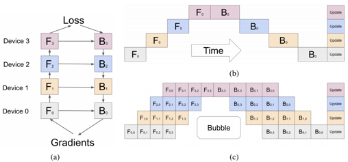

# Concept Explanation

## Data Parallelism

## Model Parallelism

To differ model parallelism from pipeline parallelism, here model parallelism represents for tensor parallelism (some
researchers may call it parameter parallelism or intra-layer model parallelism).

Popular model parallelism methods include 2D, 2.5D, 3D model-parallelism as well as Megatron(1D). There are only few
work related to 2D, 2.5D and 3D now.

## Pipeline Parallelism

Here pipeline parallelism also named as inter-layer model parallelism, because their partitions are the same, but have
some difference in executing schedule.

# Published methods of auto-parallelism, including:

I classify parallelism methods according to their partition ways.

## Pipeline Parallelism only:

|  Name  | Description | Organization or author | Paper| Framework| Year | Auto Methods
| --- | --- | --- | ---  | --- | --- | --- |
| REINFORCE | Use reinforce learning to discover model partitions | Google Brain | [mlr.press](http://proceedings.mlr.press/v70/mirhoseini17a/mirhoseini17a.pdf) | Tensorflow | PMLR 70, 2017 | Reinforce
| A hierarchical model for device placement| Use Scotch to do graph partitioning | Google |[link](https://openreview.net/pdf?id=Hkc-TeZ0W) | Tensorflow | ICLR 2018 | Reinforce LSTM
| GPipe| No implementation, see torchgpipe | Google | [arxiv](https://arxiv.org/abs/1811.06965) | None| 2018 on arxiv, NIPS2019 | averagely partition or manually
|[torchgpipe](https://github.com/kakaobrain/torchgpipe)| An A GPipe implementation in PyTorch |  UNIST | [arxiv](https://arxiv.org/pdf/2004.09910.pdf) | pytorch | 2020 on arxiv | balance stages by profiling
| GDP | A general deep RL method for automating device placements on arbitrary graphs. Orthogonal to DP,MP,PP | Google| [arxiv](https://export.arxiv.org/pdf/1910.01578.pdf) | Unknown | 2019 on arxiv | Reinforce Transformer
| TAPP | Use a Seq2Seq based on attention mechanism to predict stage for layers. | Hohai University | [mdpi](https://www.mdpi.com/2076-3417/11/11/4785/pdf) | Unknown |Appl.sci. 2021, 11 | Reinforce Seq2Seq based on attention
| Pesto | partition model based  on inter-layer model parallelism | Stony Brook University | [acm](https://www3.cs.stonybrook.edu/~anshul/middleware21_pesto.pdf) | Tensorflow | Middleware '21 | interger linear program
| [vPipe](https://github.com/hku-systems/vpipe) | A pipeline only system designed for NAS network. Complementary to hybrid parallelism| HKU | [ieee](https://ieeexplore.ieee.org/stamp/stamp.jsp?tp=&arnumber=9472938) | PyTorch | TPDS vol.33 no.3 2022 |Swap, Recompute, Partition(SRP) planner. P: Kernighan-Lin algorithm

## Data Parallelism + Pipeline Parallelism:

|  Name  | Description | Organization or author | Paper| Framework| Year | Auto Methods |
| --- | --- | --- | ---  | --- | --- | --- |
| Spotlight| Model device placement as a Markov decision process (MDP). | University of Toronto | [mlr.press](http://proceedings.mlr.press/v80/gao18a/gao18a.pdf) | PMLR 80, 2018 | Reinforce LSTM
| Placeto | Looks like Spotlight with MDP, but have different Policy. | MIT |[nips](https://proceedings.neurips.cc/paper/2019/file/71560ce98c8250ce57a6a970c9991a5f-Paper.pdf) | Tensorflow | NIPS 2019 |  Reinforce
|[REGAL](https://github.com/deepmind/deepmind-research/tree/master/regal)|a deep reinforcement learning approach to minimizing the execution cost of neural network computation graphs in an optimizing compiler. |Google|[openreview](https://openreview.net/pdf?id=rkxDoJBYPB) | Unknown |ICLR 2020 |RL with Genetic Algorithm
|[PipeDream](https://github.com/msr-fiddle/pipedream) |This repository contains the source code implementation of PipeDream and PipeDream-2BW | Microsoft Fiddle| [arxiv](https://arxiv.org/pdf/1806.03377.pdf), | Fiddle | 2018 on arxiv, SOSP 2019 | Dynamic Programming with Profile
|PipeDream-2BW | See above one | Microsoft |[arxiv](https://arxiv.org/pdf/2006.09503.pdf), [mlr.press](http://proceedings.mlr.press/v139/narayanan21a/narayanan21a.pdf)  | PyTorch | PMLR 139, 2021 | Dynamic Programming with Profile
|HetPipe| Enabling Large DNN Training on (Whimpy) Heterogeneous GPU Clusters through Integration of Pipelined Model Parallelism and Data Parallelism | UNIST | [usenix](https://www.usenix.org/system/files/atc20-park.pdf) | PyTorch (not open sourced) | USENIX 2020 | use CPLEX to solve linear programming problem
|[DAPPLE](https://github.com/AlibabaPAI/DAPPLE) | An Efficient Pipelined Data Parallel Approach for Training Large Model. Succeed from GPipe | Alibaba | [arxiv](https://arxiv.org/pdf/2007.01045.pdf) | DAPPLE | 2020 on arxiv; PPoPP 21 | Dynamic Programming
|[Chimera](https://github.com/Shigangli/Chimera) | Efficiently training large-scale neural networks with bidirectional pipelines | Department of Computer Science, ETH Zurich Switzerland | [dl.acm](https://dl.acm.org/doi/pdf/10.1145/3458817.3476145) | PyTorch | SC 2021 | Performance model with brute force
|[RaNNC](https://github.com/nict-wisdom/rannc/tree/main) | RaNNC is an automatic parallelization middleware used to train very large-scale neural networks. | DIRECT and University of Tokyo | [arxiv](http://arxiv.org/abs/2103.16063) | PyTorch | IPDPS 2021 | dynamic programming
|[HeterPS](https://github.com/PaddlePaddle/Paddle/tree/develop/paddle/fluid/framework/fleet/heter_ps)| distributed deep learning with RL based scheduling in heterogeneous environment. | Baidu |  [arxiv](https://arxiv.org/pdf/2111.10635.pdf) | Paddle | 2021 | Reinforce learning based
|

## Data Parallelism + Model Parallelism (or Tensor Parallelism):

|  Name  | Description | Organization or author | Paper| Framework| Year | Auto Methods |
| --- | --- | --- | ---  | --- | --- | --- |
|[OptCNN](https://github.com/flexflow/FlexFlow) | auto parallelism method  for CNN |Zhihao Jia | [mlr.press](http://proceedings.mlr.press/v80/jia18a/jia18a.pdf) | FlexFlow | PMLR 80, 2018 | Dynamic Programming based graph search algorithm
|[FlexFlow](https://github.com/flexflow/FlexFlow) | a deep learning framework that accelerates distributed DNN training by automatically searching for efficient parallelization strategies | Zhihao Jia | [stanford](https://cs.stanford.edu/~zhihao/papers/sysml19a.pdf) |FlexFlow, compatible with PyTorch, Keras | SysML 2019 | MCMC
|Tofu| Supporting Very Large Models using Automatic Dataflow Graph Partitioning | New York University | [dl.acm](https://dl.acm.org/doi/pdf/10.1145/3302424.3303953) | Not OpenSourced | Euro-Sys 2019 | same as OptCNN
|[AccPar](https://github.com/linghaosong/AccPar) |Tensor partitioning for heterogeneous deep learning accelerators. | Linghao Song from USC| [usc.edu](http://alchem.usc.edu/portal/static/download/accpar.pdf) | Need Manually Deploy | 2019 on arxiv, HPCA 2020 | Dynamic Programming
|[DNN-partitioning](https://github.com/msr-fiddle/dnn-partitioning)| published at NeurIPS 2020. | Microsoft Fiddle| [arxiv](https://arxiv.org/pdf/2006.16423.pdf) | proof-of-concept implementation | NIPS 2020 |Dynamic Programming and Integer Programming
|[TensorOpt](https://github.com/mindspore-ai/mindspore/tree/master/mindspore/ccsrc/frontend/parallel/auto_parallel) | Exploring the Tradeoffs in Distributed DNN Training with Auto-Parallelism | CUHK & Huawei |  [arxiv](https://arxiv.org/pdf/2004.10856.pdf) | MindSpore | 2020 on arxiv | Dynamic Programming based graph search algorithm
|[ROC](https://github.com/jiazhihao/ROC) | Another paper from Zhihao, Jia. Designed for GNN | Zhihao Jia | [mlsys](https://proceedings.mlsys.org/paper/2020/file/fe9fc289c3ff0af142b6d3bead98a923-Paper.pdf) | On top of Flexflow  | MLSys 2020 | similar to FlexFlow
|[Double Recursive](https://github.com/mindspore-ai/mindspore/tree/master/mindspore/ccsrc/frontend/parallel/auto_parallel/rec_core) | A Double recursive algorithm to search strategies | Huawei | [link](https://link.springer.com/chapter/10.1007/978-3-030-85665-6_13) | MindSpore | Euro-Par 2021 | Double Recursive
|[Pase](https://github.com/baidu-research/PaSE) |PaSE uses a dynamic programming based approach to find an efficient strategy within a reasonable time. | Baidu Research | [ieee](https://ieeexplore-ieee-org-s.nudtproxy.yitlink.com/stamp/stamp.jsp?tp=&arnumber=9460527) | prototype | IPDPS 2021 | Dynamic Programming
|SYNTHESIZING OPTIMAL PARALLELISM PLACEMENT AND REDUCTION STRATEGIES ON HIERARCHICAL SYSTEMS FOR DEEP LEARNING| offer a novel syntax-guided program synthesis framework that is able to decompose reductions over one or more parallelism axes to sequences of collectives in a hierarchy- and mapping-aware way |University of Cambridge & DeepMind | [arxiv](https://arxiv.org/pdf/2110.10548.pdf) | Simulation Experiment |2021 on arxiv, MLSys 2022 | Synthesize tool with simulation
|AutoMap| Uses Search and Learn to do find Megatron-like strategies | DeepMind | [arxiv](https://arxiv.org/pdf/2112.02958.pdf) | JAX python API, XLA backend | 2021 on arxiv, NIPS 2021

## Data Parallelism + Model Parallelism (or Tensor Parallelism) + Pipeline Parallelism:

|  Name  | Description | Organization or author | Paper| Framework| Year | Auto Methods|
| --- | --- | --- | ---  | --- | --- | --- |
|Auto-Map| Use DQN RL to search DD, MP, PP stategies | Alibaba | [arxiv](https://arxiv.org/pdf/2007.04069.pdf) | RAINBOW DQN | 2020 | Reinforce Learning
|[Piper](https://github.com/msr-fiddle/piper) | This code package contains algorithms (proof-of-concept implementation) and input files (profiled DNN models / workloads) from the paper "Piper: Multidimensional Planner for DNN Parallelization" published at NeurIPS 2021. An extension of DNN partitioning| Microsoft Fiddle| [link](https://www.microsoft.com/en-us/research/publication/piper-multidimensional-planner-for-dnn-parallelization/) | proof-of-concept implementation | NIPS 2021 | two-level dynamic programming
|[GSPMD](https://github.com/tensorflow/tensorflow/tree/master/tensorflow/compiler/xla) |a system that uses simple tensor sharding annotations to achieve different parallelism paradigms in a unified way | Google | [arxiv](https://arxiv.org/pdf/2105.04663.pdf) | Tensorflow XLA | 2021 | sharding propagation
|[DistIR](https://github.com/microsoft/dist-ir) | An intermediate representation and simulator for efficient neural network distribution | Stanford University & Microsoft Fiddle| [arxiv](https://arxiv.org/abs/2111.05426) | PyTorch | MLSys 2021 | Grid-Search Simulator
|Neo | A software-hardware co-designed system for high-performance distributed training of large-scale DLRM.  | Facebook | [arxiv](https://export.arxiv.org/pdf/2104.05158.pdf) | PyTorch | 2021 | 1. Greedy 2. Karmarker-Karp Algorithm
|Adaptive Paddle| Elastic training, fault tolerant, Cost-model based Sharding propagation |Baidu | [arxiv](https://arxiv.org/pdf/2112.02752.pdf) | Paddle | 2021 | Cost model based. Details un-given.

## Other Interesting automatic work

|  Name  | Description | Organization or author | Paper| Framework| Year | Auto Methods|
| --- | --- | --- | ---  | --- | --- | --- |
|[TASO](https://github.com/jiazhihao/TASO) | automatically optimize DNN computation with graph substitution |  Zhihao Jia |

---

## Pictures

### REINFORCE

### Spotlight

### GPipe

### GDP

### Placeto

# News

2021.12.9 DeepMind proposes Gopher, a 280 billion parameter transformer language model. Trained by 4096 16GB
TPUv3.[link](https://deepmind.com/blog/article/language-modelling-at-scale)

2021.12.8 Baidu and Peng Cheng proposes Wenxin, a 260 billion parameter knowledge-aware pretrained model (a.k.a. ERNIE
3.0 Titan). Trained with Adaptive Paddle in the Table above.  